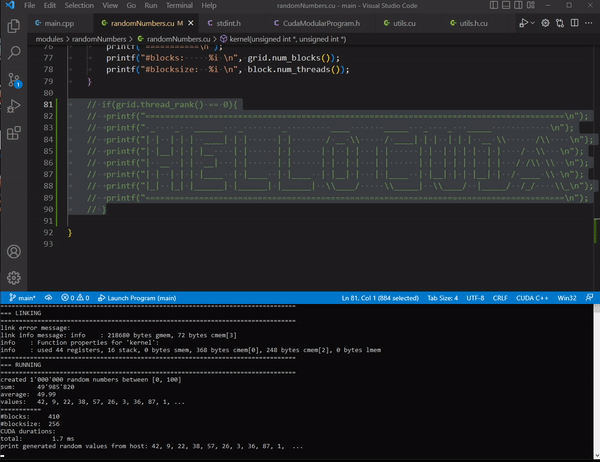
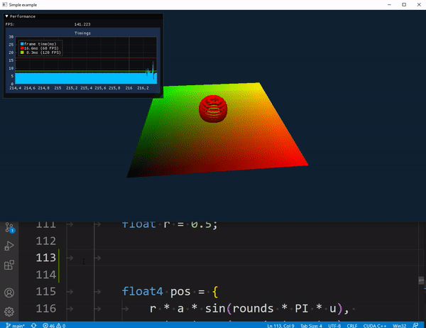
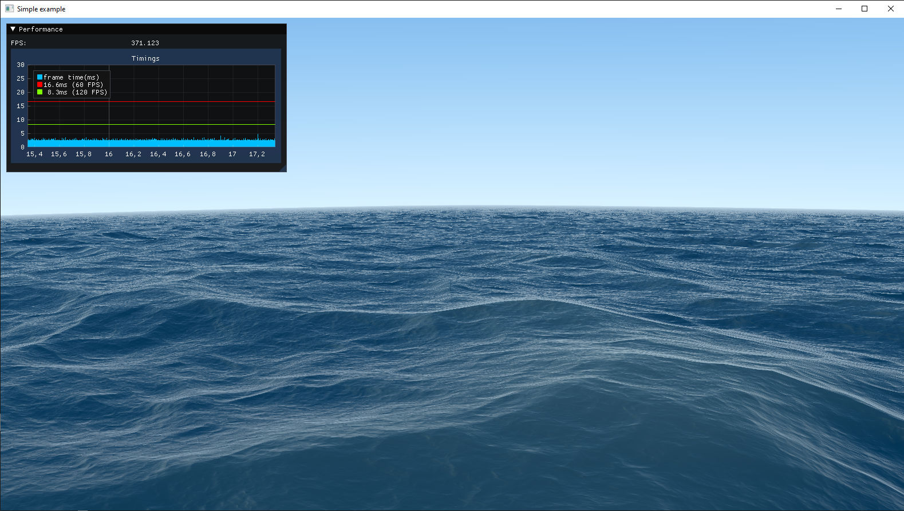

# CUDA Playground


This project provides basic templates of a cuda programs that can be <b>modified and executed at runtime</b> by saving the cuda kernel file (with ctrl+s). It's meant to help with developing algorithms by providing a near-instant feedback loop. 

Several example programs are provided, one using the console and others using OpenGL interop to draw an image with CUDA and display the resulting image with OpenGL.

## CUDA Triangle Rasterizer

Main: [main_rasterize_triangles.cpp](./modules/rasterizeTriangles/main_rasterize_triangles.cpp) <br>
Kernel: [rasterize.cu](./modules/rasterizeTriangles/rasterize.cu)

Rasterizes 25 instances of the spot model.

* First allocates bytes for an interleaved depth&color buffer
* Clears it with all launched threads
* Generates and draws a ground plane, colored by triangle index
* Then draws the spot model with rasterizeTriangles() 
	* Each cuda block grabs a triangle
	* Block projects it to screen
	* Block computes the screen-space bounding box
	* Iterates through all fragments, utilizing one block-thread per fragment
	* Each thread stores the fragment via a 64bit atomicMin that encodes depth and color 
* If colored by normalized time, computes the max time.
* Finally transfers the results from our custom buffer to an OpenGL texture


## Random Numbers

Kernel: [randomNumbers.cu](./modules/randomNumbers/randomNumbers.cu)

Generates a list of random numbers and then computes the average value. Results are printed directly by the CUDA kernel. Cooperative groups, specifically ```grid.sync()```, are used to sync all GPU threads between different passes.



## CUDA Rasterizer

Kernel: [rasterize.cu](./modules/rasterize/rasterize.cu)

Draws a parametric plane and sphere into a custom cuda framebuffer, and then transfers the result into an OpenGL texture. At each frame, the kernel 
* allocates a framebuffer from a byte buffer
* clears it with infinite depth and a background value
* samples points on the surface, projects them to pixels
* stores the closest samples by using atomicMin with a 64 bit value that contains both, depth and color.
* Then extracts the color values from the interleaved depth&color buffer, and stores the result in an OpenGL texture,



## CUDA Seascape

Kernel: [seascape.cu](./modules/seascape/seascape.cu)

A CUDA port of the shadertoy demo ["Seascape"](https://www.shadertoy.com/view/Ms2SD1) (from Alexander Alekseev aka TDM). Instead of projecting points to pixels as the rasterizer does, this demo traces rays from pixels to compute a randering of an ocean.




## Getting Started

* Open build/CudaPlayground.sln in Visual Studio 2022
* Specify your desired startup project by right clicking and selecting "Set as startup project".
* Press ctrl+f5 to compile and run the project
* Open the respective cuda file (randomNumbers.cu, rasterize.cu, seascape.cu) and try to change some code. Changes are instantly applied by saving the file. 

## Notes

* ```"--gpu-architecture=compute_75"``` is hardcoded in [CudaModularProgram.h](./include/CudaModularProgram.h). You may want to change this to access newer features. 


## Citing

This project extracts a minimal viable cuda framework from our research on software rasterization of point clouds (see github project [compute_rasterizer](https://github.com/m-schuetz/compute_rasterizer)).

```
@article{SCHUETZ-2022-PCC,
  title =      "Software Rasterization of 2 Billion Points in Real Time",
  author =     "Markus Sch\"{u}tz and Bernhard Kerbl and Michael Wimmer",
  year =       "2022",
  month =      jul,
  journal =    "Proc. ACM Comput. Graph. Interact. Tech.",
  volume =     "5",
  pages =      "1--16",
  URL =        "https://www.cg.tuwien.ac.at/research/publications/2022/SCHUETZ-2022-PCC/",
}

@article{SCHUETZ-2021-PCC,
  title =      "Rendering Point Clouds with Compute Shaders and Vertex Order Optimization",
  author =     "Markus Sch\"{u}tz and Bernhard Kerbl and Michael Wimmer",
  year =       "2021",
  month =      jul,
  doi =        "10.1111/cgf.14345",
  journal =    "Computer Graphics Forum",
  number =     "4",
  volume =     "40",
  pages =      "115--126",
  keywords =   "point-based rendering, compute shader, real-time rendering",
  URL =        "https://www.cg.tuwien.ac.at/research/publications/2021/SCHUETZ-2021-PCC/",
}
```