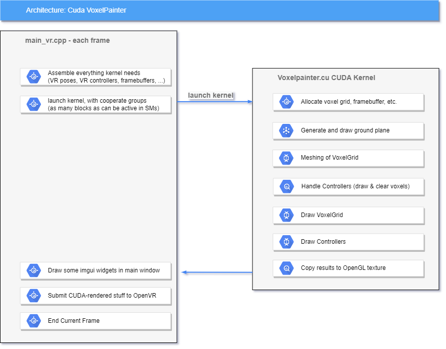

# Abstract

<b>About: </b> A CUDA-based virtual reality voxel painter that does everything in a single kernel, including game logic, meshing (marching cubes), rendering engine and software rasterization.

<b>Method: </b> Everything is done by a single CUDA "megakernel". Cooperative Groups are used to distribute variable-sized workloads from different passes to all launched GPU threads and blocks, and to globally sync between passes; a 128³ voxel grid stores "inside" and "outside" voxels; the marching cubes algorithm is used to transform the voxel grid into a mesh; and a software rasterizer draws all the generated triangles, currently utilizing one block per triangle. 

<b>Results: </b> This voxel painter runs at 90fps at a resolution of 2468x2740 per eye on an RTX 3090. In non-VR mode, it runs at around 280fps at a resolution of 2560x1140.

<b>Discussion: </b> This tech demo shows that it is viable to build real-time virtual reality applications entirely in CUDA. Being a quick&dirty prototype, there are several bottlenecks that can be addressed to significantly boost the performance in future work. Some of these bottlenecks include the marching cubes implementation; the block-based triangle rasterizer that utilizes 128 threads per triangle even for triangles that only affect few pixels; a line instead of a tile-based framebuffer layout, utilizing a single thread for the voxel brush, rather than, e.g., one per affected voxel, etc.

Most relevant code sections are found in [main_vr.cpp](../modules/VR/main_vr.cpp) and especially [voxelpainter.cu](../modules/VR/voxelpainter.cu)

This tech demo was created during the [2023 global game jam](https://globalgamejam.org/2023/jam-sites/tu-wien-ggj23).


# Getting Started

* Clone the repository.
* Open build/CudaPlayground.sln in Visual Studio 2022
* Right click "Cuda_OpenGL_VR" and "Set as startup project", if not already the case
* Make sure that you compile&run in "Release" mode.
* Run the project! (ctrl + F5)
* Click "turn on VR" in the settings panel. 

# Documentation

Relevant code is mostly located in [main_vr.cpp](../modules/VR/main_vr.cpp) and especially [voxelpainter.cu](../modules/VR/voxelpainter.cu). The latter is invoked each frame, keeps track and updates the voxel grid, draws the whole scene and then transfers the results to an OpenGL texture that can be shown on screen and also submitted to VR devices.



The following subsections briefly explain some details and design choices.

## Voxel Grid and Marching Cubes

See [marchingCubes()](https://github.com/m-schuetz/CudaPlayground/blob/24aaca3eb8c63c2c2836127927aeedc843514755/modules/VR/voxelpainter.cu#L817)

This tech demo uses a voxel grid with a size of 128³ cells. Each cell can be either empty or filled. Marching Cubes[1,2] is then used to create triangles along borders between empty and filled voxels. 

## Triangle Rasterization

See [rasterizeTriangles()](https://github.com/m-schuetz/CudaPlayground/blob/24aaca3eb8c63c2c2836127927aeedc843514755/modules/VR/voxelpainter.cu#L463)

In order to rasterize a triangle, we first project its three vertices to the screen, compute its bounding box in pixel coordinates, and then check each pixel within the bounds whether it is within the triangle or not (see [6, 10]). For the inside-outside check, we first [compute the barycentric coordinates](https://github.com/m-schuetz/CudaPlayground/blob/17e55b0e4c43bfce8592ade29395a7592a650e43/modules/VR/voxelpainter.cu#L595-L597) 

```C++
// sample: pixel coord relative to triangle bounding box
// p01, p02, p03: vertex coord relative to triangle boundig box
float s = cross(sample, p02) / cross(p01, p02);
float t = cross(p01, sample) / cross(p01, p02);
float v = 1.0 - (s + t);
```

and then check if the barycentric coordinates are inside or outside the triangle:

```C++
if(s >= 0.0)
if(t >= 0.0)
if(s + t <= 1.0)
{
	// pixel is inside triangle!
}
```

If the currently processed pixel is inside the triangle, we compute the shading and update the framebuffer. To update the framebuffer, we need to compare depth values to previously written fragments, and update depth and color buffer if the new fragment is closer. However, tens of threads might want to simultaneously update the same pixel - all of them are closer than the old depth buffer value - but only the thread with the smallest depth value should "win". We therefore need to do depth read, compare, and depth+color update in one single atomic operation. For this purpose, we encode the depth and the color value into a single 64 bit integer and compute the closest fragment per pixel via 

```C++
// homogenous component => linear depth value
float depth = projected.w; 
uint32_t color = ...;

// take 32bit float bits, reinterpret as uint32_t, upcast to uint64_t. Still a float!
uint64_t depth_u64 = *((uint32_t*)&depth);

// Store depth and color in a single 64 bit integer
// Move depth to most significant bits, so that atomicMin compares depth
uint64_t fragment = (depth_u64 << 32) | color;

// retains the fragment with the smallest depth value at each pixel
atomicMin(&framebuffer[pixelIndex], fragment);
```

The triangle rasterizer utilizes one block of threads for each triangle. Blocks retrieve the index of the next triangle they should process as follows:

```C++
// Loop through triangles, each block grabs one triangle at a time

// Store current triangle index in a shared variable
__shared__ int sh_triangleIndex;

// safety: each block renders at most 10k triangles
int loop_max = 10'000; 
for(int loop_i = 0; loop_i < loop_max; loop_i++){
	
	block.sync();
	// First thread of this block grabs index of next unprocessed triangle
	if(block.thread_rank() == 0){
		sh_triangleIndex = atomicAdd(&processedTriangles, 1);
	}
	// sync block so that all threads in block get new sh_triangleIndex value
	block.sync();

	if(sh_triangleIndex >= triangles->numTriangles) break;

	// Now start rasterizing the triangle with current block (128 threads)
	...

}
```

The reason we currently utilize one block per triangle is because each block comprises 128 threads that simultaneously process all fragments of a triangle, and which makes us therefore robust towards large triangles with lots of fragments. The downside is that we are slow at rendering large amounts of small triangles, where 1 thread per triangle might be a better choice. 

During rasterization, we iterate through fragments of a triangle's screen-bounding-box, utilizing one thread per fragment. The following loop first processes fragments [0, 127], in the next iteration fragments [128, 255], and so on. The x and y coordinates of the fragment within the box are computed by modulo with the box width to obtain the x coordinate, and by division with the width to obtain the y coordinate. 

```C++
// iterate through fragments in bounding rectangle and draw if within triangle
int numProcessedSamples = 0;
for(int fragOffset = 0; fragOffset < numFragments; fragOffset += block.num_threads()){

	// safety mechanism: don't draw more than <x> pixels per thread
	if(numProcessedSamples > 5'000) break;

	int fragID = fragOffset + block.thread_rank();

	// Fragment coord relative to triangle's bounding box
	int fragX = fragID % size_x;
	int fragY = fragID / size_x;

	// Absolute frag coord
	float2 pFrag = {
		floor(min_x) + float(fragX), 
		floor(min_y) + float(fragY)
	};

	// some more fragment processing
	...

}
```

The reason for utilizing one thread block comprising 128 threads per triangle is that otherwise, huge triangles would lead to extremely low frame rates. With 128 threads per triangle, the worst-case times are far better, but the best-case times are far worse. Better approaches might instead split large triangles into smaller work packages and utilize one thread per package. Prior work has shown that software rasterization can be competitive in special cases [4, 7], and in particular Nanite[3] has shown that software-rasterization of triangles can lead to 3x performance improvements over the native hardware rasterizer. For point clouds, software rasterization has already shown to be 10 to 100 times faster than native point primitives such as GL_POINTS [5, 8, 9], and we are currently investigating performance improvements via software rasterization for other non-triangle primitives such as splats, voxels, etc..

## Megakernels

Typically if you have multiple passes that depend on previous results, or passes with different workload sizes and parallelism, you'd invoke multiple kernels with the proper amount of workgroups and threads per workgroup. However, this application is written in one single kernel that is invoked once per frame, so syncing between passes and distributing workload to all available threads is necessary.

### Syncing
If one pass depends on the results of a previous pass, we can add a sync point to wait until all threads have finished with the previous pass. In CUDA, we can globaly sync all threads with cooperative groups using cooperative_groups::this_grid.sync() (shortened to ```grid.sync()```). grid.sync() is used liberally throughout the application, for example after clearing the framebuffers to make sure they are fully cleared before they are used, or between updating and meshing the voxel grid. (And very often for no particular reason, just to be on the safe side.)

### Parallelism / Amount of workgroups

The kernel is launched once per frame with as many workgroups as the streaming multiprocessors (SM) can concurrently process. We use ```cuOccupancyMaxActiveBlocksPerMultiprocessor``` to find how many blocks each SM can process (depends on kernel complexity), and launch with ```cuLaunchCooperativeKernel```. When implementing custom global sync via spinlock, this would be important because otherwise some threads would spin forever, waiting for threads that never get their turn because the spinning threads occupy all the SMs. If we only launch as many workgroups/threads as the SMs can keep active, this type of deadlock won't happen as the SM will give all launched threads a chance to operate. I asume that this is one of the reasons why cooperative groups require a special ```cuLaunchCooperativeKernel``` launch call that prevents you from launching too many workgroups/threads.

### processRange helper function

Different passes have very different workloads, ranging from modifying one single global value, to 128³ voxel cells, to width * height pixels, and more. With the [processRange()](https://github.com/m-schuetz/CudaPlayground/blob/17e55b0e4c43bfce8592ade29395a7592a650e43/modules/VR/utils.h.cu#L23) helper function, we can distribute a variable amount of function calls to all the threads that we've spawned this frame.

```C++
// process all 128³ cells of the voxel grid.
// the 128³ function calls are distributed to all spawned workgroups and threads
processRange(0, 128 * 128 * 128, [&](int voxelIndex){ 
	// update voxel cell

	// get current thread's index within whole grid, if necessary
	grid.thread_rank();

	// get current thread's index within workgroup, if necessary
	block.thread_rank();
});

// wait until all voxels are updated
grid.sync();

// do marching cubes to create triangle mesh
processRange(0, 128 * 128 * 128, [&](int voxelIndex){ 
	// check samples in 2x2x2 neighborhood, and create triangles 
});

// do some other stuff
...

grid.sync();

// process all width * height pixels of the framebuffer
// the width * height function calls are distributed to all spawned workgroups and threads
processRange(0, width * height, [&](int pixelIndex){ 
	int x = pixelIndex % width;
	int y = pixelIndex / width;
	// do something with pixel
});
```

Note that processRange() is here for convenience, but it is rarely the fastest way to do things. Often it is faster to write a custom loop where 32 threads in a warp process 32 consecutive items in memory, then the next 32 consecutive items, etc, while processRange might distribute items [0, 99] to thread 0, items [100, 199] to thread 1, etc. Each thread of processRange() may invoke an individual load from global memory, while making 32 consecutive threads load 32 consecutive items from memory may only require a single load from global memory to fetch all the data at once. The convenience of processRange() is great to quickly get things done, though. 


## Allocations

The CUDA kernel is called once per frame and needs to hold persistent memory that is reused in future kernel invocations (e.g. voxel grid) as well as temporary memory that is cleared and rebuilt from scratch each frame (e.g. framebuffers). To achieve this, we pass a large byte array to the kernel ``` kernel(..., uint32_t* buffer, ...) ``` and use a custom allocator that reserves memory from that buffer. 

```C++
// In each frame, "allocator" always starts handing out memory from byte 0 of the buffer. 
// Since voxelGrid is the first thing we allocate in a frame, 
// it is allways guaranteed to point to the first byte, and reserve 128³ * 4 bytes.
// Due to this, it is guaranteed that each frame uses the same voxelGrid data.
uint32_t* voxelGrid = allocator->alloc<uint32_t*>(numCells * sizeof(uint32_t));
```

```C++
// We also allocate bytes for main framebuffer and eyes at the start of a frame, 
// but their location in memory does not matter because we clear them anyway
// Allocations after this point are not guaranteed to point to the same memory
// every frame because framebuffer width and height may change over time.
uint64_t* framebuffer = allocator->alloc<uint64_t*>(width * height * sizeof(uint64_t);
uint64_t* fb_vr_left  = allocator->alloc<uint64_t*>(vr_width * vr_height * sizeof(uint64_t));
uint64_t* fb_vr_right = allocator->alloc<uint64_t*>(vr_width * vr_height * sizeof(uint64_t));
```

# Discussion, Limitations, Future Work

This tech demo was created to evaluate the feasibility of writing entire applications in CUDA, and even one single CUDA kernel. It was inspired by shadertoy.com demos that managed to code games within just a single fragment shader, such as [Bricks Game](https://www.shadertoy.com/view/MddGzf), [Pacman](https://www.shadertoy.com/view/Ms3XWN), [Quake](https://www.shadertoy.com/view/lsKfWd) and others. If you can write entire games in fragment shaders, surely you can write even more powerful and potentially performant games and applications in CUDA. 

Once the triangle rasterizer and hot reloading of CUDA code via the driver API were up and running, the rest turned out to be relatively simple. Hot reloading the application code at runtime by simply saving the file via ctrl+s tremendously improved productivity as it reduced the feedback loop of "let's see if this works" and "it doesn't, try again" from minutes to 1-5 seconds. 

As a quick&dirty prototype, this tech demo has many bottlenecks and parts that do not run as fast as they could. For example:

* The liberal use of the "processRange" helper function quickly makes things work, but not always as efficient as they could be. Many parts of the application would benefit from operating data in a more coalesced order. 
* The triangle rasterizer uses one block of 128 threads per triangle which handles large triangles somewhat efficiently, but leaves a lot of performance on the table when it comes to small triangles. 
* The framebuffer memory is organized in a line-wise fashion. Especially for post-processing, it may be beneficial to organize it in a tile-wise fashion, e.g., 8x8 blocks of pixels so that access to adjacent pixels may more often retrieve values from cache. Workgroups could also process one pixel-tile at a time, preload pixels from global memory to shared memory (L1 cache), and then do heavy post-processing operations directly in L1 cache. 
* The marching cubes algorithm is executed once per frame for the entire 128³ voxel grid. It could instead only run for modified regions of the grid, and it could already include backface culling. 
* Voxel Hashing could be used to implement voxel grids with arbitrarily large spatial size, and a hierarchical voxel structure could be used significantly increase the resolution. 


# References

* [1] http://paulbourke.net/geometry/polygonise/
* [2] [Marching cubes: A high resolution 3D surface construction algorithm](https://dl.acm.org/doi/abs/10.1145/37402.37422)
* [3] [A Deep Dive into Nanite](https://www.youtube.com/watch?v=eviSykqSUUw)
* [4] [High-performance software rasterization on GPUs](https://dl.acm.org/doi/abs/10.1145/2018323.2018337)
* [5] [Software Rasterization of 2 Billion Points in Real Time](https://arxiv.org/abs/2204.01287)
* [6] https://erkaman.github.io/posts/fast_triangle_rasterization.html
* [7] [A High-Performance Software Graphics Pipeline Architecture for the GPU](https://arbook.icg.tugraz.at/schmalstieg/Schmalstieg_350.pdf)
* [8] [A GPGPU-based pipeline for accelerated rendering of point clouds](https://otik.uk.zcu.cz/bitstream/11025/6978/1/Gunther.pdf)
* [9] [Rendering Point Clouds with Compute Shaders and Vertex Order Optimization](https://www.cg.tuwien.ac.at/research/publications/2021/SCHUETZ-2021-PCC/)
* [10] http://www.sunshine2k.de/coding/java/TriangleRasterization/TriangleRasterization.html#algo3